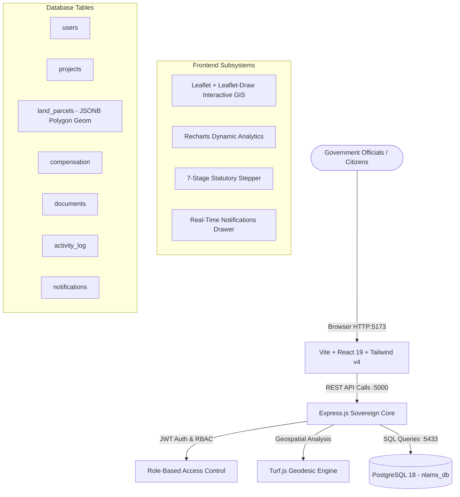

# NLAMS — National Land Acquisition & Management System (राष्ट्रीय भूमि अर्जन एवं प्रबंधन प्रणाली)
> **Smart India Hackathon (SIH 2026) Working Prototype**  
> *Ministry of Rural Development / Department of Land Resources (DoLR), Government of India*

---

## 🏛️ Executive Summary

**NLAMS** is an end-to-end, sovereign enterprise GIS and statutory lifecycle management platform that digitizes the entire land acquisition workflow governed by the **Right to Fair Compensation and Transparency in Land Acquisition, Rehabilitation and Resettlement (RFCTLARR) Act, 2013**.

Traditional land acquisition in India suffers from fragmented land records, delays of 3–5 years across statutory gazette notifications, dispute litigation, and manual disbursement leaks. NLAMS bridges this gap by unifying:
1. **Interactive Geospatial Cadastral Mapping**: Sub-meter arbitrary polygon parcel delineation, multi-layer GIS toggles (OpenStreetMap, CartoDB Positron, Satellite imagery), and automated geodesic area computation in hectares.
2. **7-Stage Statutory Workflow Engine**: Strict, auditable role-gated state transitions with digital noting and Digital Signature Certificate (DSC) verification.
3. **Direct Benefit Transfer (DBT) Compensation Ledger**: PFMS/NPCI-aligned compensation assessment, multi-tier solatium calculations, and bank disbursement status tracking.
4. **Statutory Document Vault**: Tamper-evident repository with multi-party verification for Section 4, 11, 19 gazettes and SIA reports.
5. **Real Database-Backed Architecture**: Backed by PostgreSQL with zero mock data.

---

## 🎯 Architecture & Tech Stack



### Geospatial Implementation & PostGIS Fallback Note
As per hackathon production fallback standards: When PostGIS binary C-extensions are unavailable on the deployment host, NLAMS automatically utilizes the robust **JSONB Polygon Coordinate Standard** (`geom JSONB NOT NULL`) combined with `@turf/turf` on both frontend and backend.
- Area in hectares is calculated geodesically on Earth's ellipsoid using `turf.area(polygon) / 10000`.
- Polygons are validated for self-intersection, coordinate closure, and GeoJSON compliance.

---

## 🔑 Demo User Accounts (5 Roles)

NLAMS enforces strict statutory Role-Based Access Control (RBAC). All 5 accounts are pre-seeded and accessible via 1-click quick login buttons on the login page:

| Role | Name & Designation | Email | Password | Primary Permissions |
| :--- | :--- | :--- | :--- | :--- |
| **Citizen / Landowner** | Ramesh Kisan Patil (Khatedar) | `citizen@nlams.gov.in` | `citizen123` | View parcel survey details, claim status, R&R compensation entitlements. |
| **Field Revenue Inspector** | Suresh K. Verma (Patwari / Amin) | `field@nlams.gov.in` | `field123` | GIS polygon drawing, mobile GPS ground capture, geo-tagged photo upload. |
| **District Collector / SLAO** | Dr. Rajesh Sharma, IAS (District Collector & Magistrate) | `district@nlams.gov.in` | `district123` | District scrutiny, Section 11/19 gazette declaration, DSC award approval. |
| **State Principal Secretary** | Smt. Sunita Rao, IAS (Pr. Secretary, Revenue) | `state@nlams.gov.in` | `state123` | State cabinet approvals, inter-district corridor clearance, budget sanction. |
| **Union Ministry / PMG** | Vikramaditya Malhotra (Joint Secretary, DoLR & PMG) | `ministry@nlams.gov.in` | `ministry123` | National dashboard, multi-state PM GatiShakti alignment, sovereign audit oversight. |

---

## 🚀 Quickstart & Running Locally

### Prerequisites
- **Node.js**: v18+ (v20+ recommended)
- **PostgreSQL**: Running on port `5433` (or configured via `.env` / `server/db/pool.js`)

### 1. Installation
All dependencies for both root, server, and frontend are installed:
```bash
# In the root repository directory
npm install
npm --prefix server install
npm --prefix client install
```

### 2. Database Setup & Seeding
If setting up a fresh PostgreSQL database:
```bash
# Run migrations to create 7 tables and indices
npm run migrate

# Seed database with 9 projects, 18 parcels, compensation, documents, users
npm run seed
```

### 3. Launch Development Servers
Run both backend API (`localhost:5000`) and Vite frontend (`localhost:5173`) with a single command:
```bash
npm run dev
```

Open your browser to: **[http://localhost:5173](http://localhost:5173)**

---

## 📜 Statutory 7-Stage Workflow (RFCTLARR 2013)

NLAMS faithfully models the 7 sequential stages required by Indian statutory law:

1. **`proposal_submission`** — Requisitioning body (e.g., NHAI, Dedicated Freight Corridor) submits land requirement, alignment, and preliminary feasibility.
2. **`district_scrutiny`** — Collector / SLAO scrutinizes revenue records (7/12 extracts, Jamabandi, Khasra) and checks feasibility.
3. **`state_approval`** — State Revenue Department accords administrative sanction and designates the competent authority.
4. **`section_11`** — Statutory Preliminary Notification under Section 11 published in the Official Gazette and local newspapers; SIA commenced.
5. **`section_19`** — Declaration of Acquisition under Section 19 issued after hearing public objections under Section 15.
6. **`award_enquiry`** — Section 23/26 summary enquiry; market valuation determined, 100% solatium added, and formal compensation award drafted.
7. **`possession_taken`** — Full compensation disbursed into landowner escrow accounts via PFMS DBT; physical possession taken under Section 38/40.

---

## 🌐 Complete API Specification

### Authentication
- `POST /api/auth/login` — Authenticate user and issue signed JWT token.
- `GET /api/auth/me` — Return current authenticated session profile.

### Dashboard & Telemetry
- `GET /api/dashboard/summary` — Returns real PostgreSQL aggregated metrics:
  - `total_area_notified_ha` (e.g. 116.44 ha)
  - `total_area_acquired_ha` (e.g. 79.00 ha)
  - `total_area_possessed_ha` (e.g. 52.70 ha)
  - `total_compensation_assessed_cr` (e.g. ₹94.14 Cr)
  - `total_compensation_paid_cr` (e.g. ₹57.23 Cr)
  - `pct_compensation_disbursed` (e.g. 60.8%)
  - `total_families_affected` (e.g. 43)
  - Stage-wise distribution and SLA triage lists.
- `GET /api/dashboard/map-data` — GeoJSON FeatureCollection of all parcels with status colors, survey numbers, and project codes.

### Projects
- `GET /api/projects` — Filterable directory of land acquisition proposals (by state, status, type, search).
- `GET /api/projects/:id` — Complete project dossier with nested parcels, documents, and timestamped activity logs.
- `POST /api/projects` — Register a new statutory land acquisition project.
- `PATCH /api/projects/:id/advance-status` — Advance project to next statutory stage (role-gated, updates `activity_log`, triggers notification).

### Cadastral Land Parcels
- `GET /api/parcels` — List parcels with optional filters (`project_id`, `status`, `search`).
- `POST /api/parcels` — Create new parcel with GeoJSON polygon; auto-computes area via Turf.js and auto-generates linked compensation record.
- `GET /api/parcels/:id` — Retrieve specific parcel details.

### Compensation & DBT Ledger
- `GET /api/compensation` — List all compensation and R&R awards across all projects.
- `PATCH /api/compensation/:id/status` — Update compensation payment status (`pending`, `processed`, `disbursed`) and R&R status (`pending`, `allotted`, `rehabilitated`).

### Document Vault
- `GET /api/documents` — List statutory gazette notifications, SIA reports, and valuation orders.
- `POST /api/documents` — Upload statutory PDF document with metadata (`multer` storage).
- `PATCH /api/documents/:id/verify` — Toggle legal verification seal (District/State official).

### Notifications & Live Telemetry
- `GET /api/notifications` — Fetch user's notification feed.
- `PATCH /api/notifications/:id/read` — Mark notification as read.
- `PATCH /api/notifications/read-all` — Mark all user notifications as read.

### Admin & Demo
- `POST /api/admin/reseed` — Instant 1-click demo reset. Restores pristine database state in under 1 second.

---

## 🎬 Hackathon Demo Script for the Jury

Follow this 3-minute live walkthrough to show the jury the full power of NLAMS:

1. **Login Screen**:
   - Point out the NIC/Digital India aesthetic, GIS grid backdrop, and the **1-Click Quick Demo Login** buttons.
   - Click **"District Collector"** (`district@nlams.gov.in`).
2. **Executive Dashboard**:
   - Show the 6 real-time KPI cards. Emphasize that every number (e.g. 116.44 Ha, ₹94.14 Cr) is queried live from PostgreSQL.
   - Interact with the interactive Leaflet GIS preview and stage distribution donut chart.
3. **Interactive Cadastral GIS (`/gis-map`)**:
   - Select the polygon tool (draw icon) from the Leaflet Draw toolbar.
   - Click 4 or 5 points on the map to draw an arbitrary parcel boundary and double click to finish.
   - Watch the modal instantly compute the real surface area in hectares using `@turf/turf`!
   - Fill in Survey # `SUR-MH-2026-99`, owner name `Kisan Baburao`, and click **"Commit Cadastral Record"**.
   - Inspect the newly created parcel immediately highlighted on the map in emerald green.
4. **Statutory Workflow Stepper (`/projects/1`)**:
   - Open the **NH-48 Western Freight Spur** project.
   - Highlight the 7-stage interactive stepper. Notice the current stage is `District Scrutiny`.
   - Click the green **"Approve & Advance to State Approval"** button.
   - Check the **"Digital Signature Certificate (DSC) Authentication"** checkbox, type noting remarks, and click confirm.
   - Watch the stepper update live, the audit trail add the timestamped entry, and the official notification arrive!
5. **Direct Benefit Transfer (DBT) Ledger (`/compensation`)**:
   - Show the disbursement ledger. Click **"Update Payment"** on any pending claim, switch it to `Disbursed`, and observe total disbursement numbers update.
6. **Mobile Field Capture (`/field-capture`)**:
   - Switch role or view the Patwari/Field Officer ground capture tool with live GPS simulation and photo attachment preview.
7. **1-Click Demo Reseed**:
   - Click the **"Reset Demo DB"** button in the header bar to demonstrate that the database can be cleanly reset anytime during the presentation.

---

## 🛡️ License & Acknowledgments
Built for **Smart India Hackathon 2026**. Designed according to Government of India Indian Web Guidelines (GIGW) and the RFCTLARR Act 2013 statutory framework.
